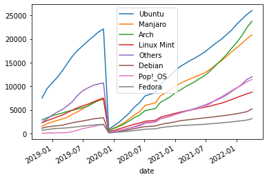
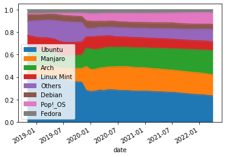
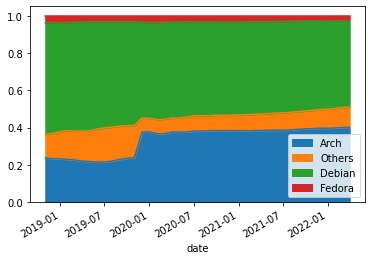
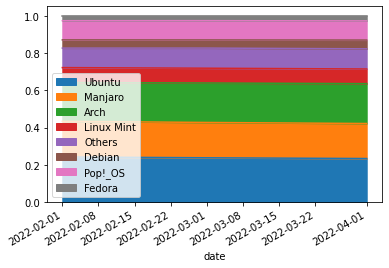
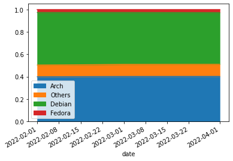
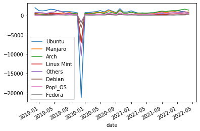
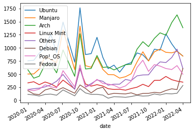
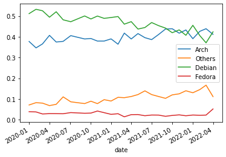

# Analysis of ProtonDB Linux Distribution

```python
# !git clone https://github.com/bdefore/protondb-data
```

## Preprocessing

```python
import os
import pandas as pd
import glob
import tarfile
import json
```

```python
def find_distro(string):
    os_str = string.split(" ")[0]

    distros = ["ubuntu","manjaro","arch","pop!_os","debian","fedora","linux mint"]

    if os_str.lower() not in distros and len(string.split(" "))>1:
        os_str += " " + string.split(" ")[1]

    manjaro_based = ["manjaro"]
    if any(x in os_str.lower() for x in manjaro_based):
        os_str = "Manjaro"

    arch_based = ["arc","antergos","gamer","ctlos","artix","endeavour"]
    if any(x in os_str.lower() for x in arch_based):
        os_str = "Arch"

    ubuntu_based = ["kde","elementary","zorin","ubuntu"]
    if any(x in os_str.lower() for x in ubuntu_based):
        os_str = "Ubuntu"

    mint_based = ["lmde","mint"]
    if any(x in os_str.lower() for x in mint_based):
        os_str = "Linux Mint"

    pop_based = ["pop"]
    if any(x in os_str.lower() for x in pop_based):
        os_str = "Pop!_OS"

#     suse_based = ["suse"]
#     if any(x in os_str.lower() for x in suse_based):
#         os_str = "OpenSUSE"

#     flatpack = ["freedesktop"]
#     if any(x in os_str.lower() for x in flatpack):
#         os_str = "Flatpak"

    debian_based = ["steamos","siduction","sparky","devuan","mx","deepin","debian"]
    if any(x in os_str.lower() for x in debian_based):
        os_str = "Debian"

    fedora_based = ["fedora"]
    if any(x in os_str.lower() for x in fedora_based):
        os_str = "Fedora"

    if os_str.lower() not in distros:
        os_str = "Others"

    return os_str

def read_os_from_tar(path):
    print("reading",path)
    with tarfile.open(path,"r") as f:
        data = f.extractfile("reports_piiremoved.json").read()
    data = json.loads(data)
    data = pd.DataFrame(data)

    date_str = os.path.split(path)[1][8:-7]
    month = date_str[:3]
    day = date_str[3]
    year = date_str[5:]
    date_str = pd.to_datetime("-".join([month,day,year]))

    if date_str >= pd.to_datetime("dec-2-2019"):
        df = pd.json_normalize(data['systemInfo'])
    else:
        df = data.dropna(subset=["os"]).copy()

    df["os"]=df["os"].apply(find_distro)
    os_data = df["os"].value_counts()
    os_df = pd.DataFrame(os_data).transpose().reset_index(drop=True)
    os_df["date"] = date_str

    return os_df
```

```python
if False:#os.path.exists("proton_db_os.hdf5"):
    df_report = pd.read_hdf("proton_db_os.hdf5","df")
else:
    df_report = pd.DataFrame(read_os_from_tar('protondb-data/reports/reports_dec2_2019.tar.gz'))

for path in glob.glob("protondb-data/reports/*.gz"):
    date_str = os.path.split(path)[1][8:-7]
    month = date_str[:3]
    day = date_str[3]
    year = date_str[5:]
    date_str = pd.to_datetime("-".join([month,day,year]))
    if date_str not in df_report["date"].to_numpy():
        try:
            df_temp = read_os_from_tar(path)
        except:
            continue
        df_report = pd.concat([df_report,df_temp],ignore_index=True)
```

```python
df_report.to_hdf("proton_db_os.hdf5","df")
```

## Cumulative Results

**Note:** On Dec 2nd 2019, ProtonDB contribute workflow changed to a questionnaire, subsequently changed the data structures. All data prior to this date are for reference only and should NOT be inferred.

### Raw user counts per distro

```python
df_report.plot(x="date")
```




### Normalized distro market share on ProtonDB

```python
normalizedDataFrame = df_report[df_report.columns[:-1]].div(df_report[df_report.columns[:-1]].sum(axis=1), axis=0)
normalizedDataFrame["date"]=df_report["date"]
normalizedDataFrame.plot.area(x="date",stacked=True)
```




### Normalized distro market share on ProtonDB (Merged distro base)

```python
normalizedDataFrame_combined = normalizedDataFrame.copy()
normalizedDataFrame_combined["Arch"]=normalizedDataFrame_combined[["Arch","Manjaro"]].sum(axis=1)
normalizedDataFrame_combined = normalizedDataFrame_combined.drop(columns="Manjaro")
normalizedDataFrame_combined["Debian"]=normalizedDataFrame_combined[["Linux Mint","Ubuntu","Pop!_OS","Debian"]].sum(axis=1)
normalizedDataFrame_combined = normalizedDataFrame_combined.drop(columns=["Linux Mint","Pop!_OS","Ubuntu"])
```

```python
normalizedDataFrame_combined.plot.area(x="date",stacked=True)
```



Arch Linux and Arch-based distro is on the rise, while Debian-based (Ubuntu) distros are on the decline. Is this a shift due to Steam Deck and SteamOS? We'll filter from Jan 1st 2022 till now to see if there is a shift in the market share.

```python
normalizedDataFrame[normalizedDataFrame["date"]>pd.to_datetime("jan-1-2022")].plot.area(x="date",stacked=True)
```




```python
normalizedDataFrame_combined[normalizedDataFrame_combined["date"]>pd.to_datetime("jan-1-2022")].plot.area(x="date",stacked=True)
```




The data is ambiguous, we'll need to see monthly increased user counts to see if this is the case.

## Monthly delta of user counts

```python
df_delta = df_report.sort_values(by="date",ascending=False)-df_report.sort_values(by="date",ascending=False).shift(-1)
df_delta.pop("date")
df_delta["date"]=df_report["date"]
df_delta.plot(x="date")
```




Let's zoom in after Dec 2nd 2019 (when the questionnaire was released)

```python
df_delta = df_delta[df_delta["date"]>pd.to_datetime("dec-2-2019")]
df_delta.plot(x="date")
```




```python
normalizedDataFrame = df_delta[df_delta.columns[:-1]].div(df_delta[df_delta.columns[:-1]].sum(axis=1), axis=0)
normalizedDataFrame["date"]=df_delta["date"]
normalizedDataFrame_combined = normalizedDataFrame.copy()
normalizedDataFrame_combined["Arch"]=normalizedDataFrame_combined[["Arch","Manjaro"]].sum(axis=1)
normalizedDataFrame_combined = normalizedDataFrame_combined.drop(columns="Manjaro")
normalizedDataFrame_combined["Debian"]=normalizedDataFrame_combined[["Linux Mint","Ubuntu","Pop!_OS","Debian"]].sum(axis=1)
normalizedDataFrame_combined = normalizedDataFrame_combined.drop(columns=["Linux Mint","Pop!_OS","Ubuntu"])
```

```python
normalizedDataFrame_combined.plot(x="date")
```




Debian-based new installation is on a constant decline, while arch and "other" distros are on a rise. As the market share of "other" distros is not as significant as Debian or Arch derivatives, we won't go deeper into this category.

```python
normalizedDataFrame_combined[normalizedDataFrame_combined["date"]>pd.to_datetime("dec-1-2021")].plot(x="date")
```


New install of both Arch and Debian-based distros is on plateau. So for now, the release of Steam Deck is not that big of a disruption. Interestingly, in April there is a spike in installation of Fedora
